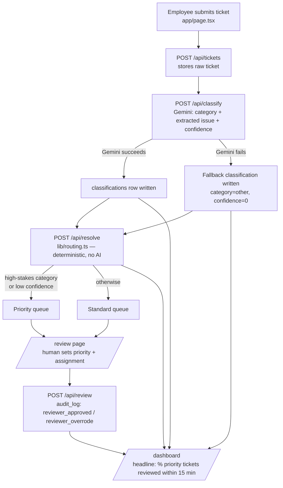

# Architecture

## One-paragraph summary

A ticket comes in through a simple form. One AI call (Gemini) does exactly
two things: assign a category, and pull the real issue out of messy text.
Everything after that — which queue a ticket lands in, who's allowed to set
priority, who gets assigned, whether it escalates — is deterministic code
enforcing a policy that came directly from a stakeholder interview, not from
model confidence. A human always makes the final call on priority,
assignment, and escalation. Every decision, by code or by a person, is
written to one append-only audit log that the dashboard and review queue
both read from directly — there is no separate status field that could
drift out of sync with what actually happened.

This document explains why the system is shaped this way, not just what
each file does.

## System flow

Note that the AI step (`/api/classify`) and the routing step (`/api/resolve`)
are separate HTTP calls, not one function — that separation is deliberate,
see below.

## The deterministic / AI / human split

This is the actual design decision the whole project demonstrates. It came
directly from the M0 discovery interview (`docs/discovery-brief.md`, section
6), not from a general best-practice template:

| Decision | Made by | Where in code | Why |
|---|---|---|---|
| Categorise the ticket | AI (Gemini) | `lib/classification.ts` | Genuinely a judgment call on messy natural-language input — this is what LLMs are good at |
| Extract the real issue from rambling text | AI (Gemini) | `lib/classification.ts` | Same reasoning — the "buried lede" problem from discovery is a language-understanding problem |
| Decide which queue a ticket lands in | Deterministic code | `lib/routing.ts` | Stakeholder was explicit that this must be predictable and auditable, not a model guess. A rule ("this category is always high-stakes," "this confidence is too low to trust") is easier to explain, test, and defend than a second model call would be |
| Set priority | Human | `/review` → `/api/review` | Discovery brief section 6 — always requires human approval, regardless of confidence |
| Assign technician | Human | `/review` → `/api/review` | Same |
| Escalate | Human | `/review` → `/api/review` | Same |
| Take any technical action | Human, entirely outside this system | Out of scope | Explicit stakeholder instruction — never automated |

**Why classification and routing are two separate API calls instead of one
function:** it would have been easy to have `/api/classify` also decide the
queue while already holding the classification result in memory. Keeping
them as two separate routes with two separate files makes the AI/deterministic
boundary a structural fact about the codebase, not just a documented
intention. A future engineer (or an interviewer reading the code) can see
that `lib/routing.ts` has zero AI calls in it, rather than having to trust a
comment saying so.

## Data model

Three tables, described fully in `supabase/schema.sql`:

- **`tickets`** — the raw submission: text, submitter, channel, self-rated
  urgency. Immutable once created.
- **`classifications`** — one or more AI classification attempts per ticket
  (category, extracted issue, confidence). Only the most recent is used by
  routing, but earlier ones aren't deleted — useful if classification is
  ever re-run.
- **`audit_log`** — append-only. Every decision, whether made by the routing
  rule (`decided_by: "system"`) or a named reviewer
  (`decided_by: "human:<name>"`), is a new row here. There is no `status`
  column on `tickets` tracking "pending" vs "resolved" — that status is
  always derived by asking "does this ticket have a system decision but no
  human decision yet?" (see `app/api/review-queue/route.ts`). This was a
  deliberate tradeoff: slightly more computation per request, in exchange
  for one single source of truth that can't silently drift out of sync with
  itself.

## Why these specific technology choices

| Choice | Reasoning |
|---|---|
| Next.js on Vercel | Free tier, serverless functions included, no separate backend host to run or pay for |
| Supabase (Postgres) | Free tier, real SQL rather than a document store — matters for an audit log where relational integrity (foreign keys between tickets/classifications/audit_log) is the point |
| Gemini for classification | Already had an active API key; the classification interface (`ClassificationResult`) is provider-agnostic by design, so swapping to another model would mean rewriting one file, not the architecture |
| GitHub Pages for the case-study landing page | The actual working app lives on Vercel; Pages hosts the calmer, single-entry-point view a reviewer opens first |

## Known failure modes and how they're handled

Full detail and real test results are in `docs/evaluation.md`. Summary:

- **Gemini unavailable** → `/api/classify` writes a fallback classification
  (`confidence: 0`) rather than aborting, which the existing routing
  threshold automatically sends to the priority queue. No ticket is ever
  silently dropped, confirmed by an actual simulated outage during M6.
- **Malformed or empty requests** → every POST route parses its body through
  a shared helper (`lib/http.ts`) that returns a clean 400, rather than
  letting an unparseable body throw an uncaught exception.
- **Stale reads under Next.js's App Router caching** → a real bug found
  during testing, not a hypothetical: Next patches `fetch`, and
  `supabase-js`'s REST calls go through that same patched `fetch`, so Supabase
  reads were being cached independently of each route's own cache settings.
  Fixed with a shared no-cache client (`lib/supabaseServer.ts`) plus explicit
  route-level and app-level cache opt-outs. Full writeup in
  `docs/build-journal.md`.

## What this system deliberately does not do

- It does not auto-execute priority, assignment, or escalation under any
  confidence level — see the split table above.
- It does not retry a failed Gemini call or fail over to a second provider.
  Correctness (never losing a ticket) was solved in M6; availability under
  sustained AI-provider outage was named as a real next step
  (`docs/evaluation.md`) rather than built here, to keep this project's
  scope matched to what it's meant to demonstrate.
- It does not take any technical action on a user's behalf. That boundary
  came directly from the stakeholder and was treated as non-negotiable
  throughout the build.
